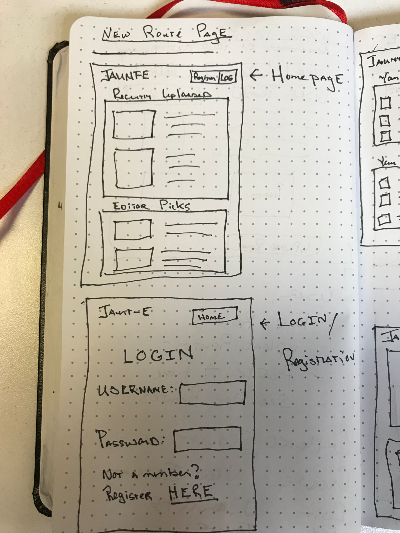
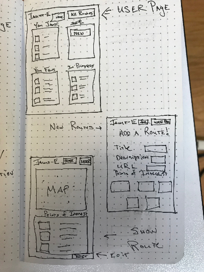
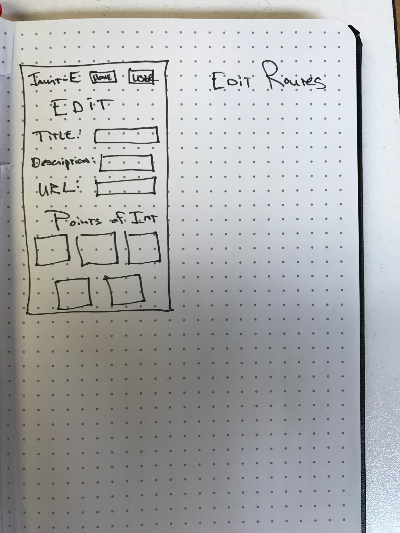

# JAUNT-E
A Collection Of Short Excursions and Journeys of Pleasure

##User Stories

* Visitor lands on login page, sees recently created jaunts from all users as well as jaunt choices curated by site admins. 

* Visitor chooses to register or login with a username and password, (encrypted on server) and is able to enter the site in order to create and edit jaunts as well as collect favorites.

* After logging in, Visitor becomes Jaunter. Jaunter lands on their user page displaying a list of their draft jaunts, completed jaunts, favorite jaunts by other Jaunters and controls to create new jaunts.

* Jaunter clicks on a jaunt they've been editing from their drafts list and enters an edit page. Decides to add Points of Interest, clicks the POI edit button.

* On POI edit page, enters 3 points of interest, which populate on the bottom of the page. Upon submit goes back to Jaunt edit page.

* Jaunter completes the jaunt (including a pic from the jaunt, up to five points of interest on the jaunt with corresponding descriptions/pics/geo-locators, a description and title) and publishes it to the general pool of jaunts.

* Jaunter clicks on a favorite jaunt of another Jaunter listed on their own page for inspiration. No edit link is available since they didn't create it. They click their profile button from the nav bar and jump back to their own profile page. Jaunter decides to update an existing jaunt that they already published.

* Jaunter clicks on jaunt they formerly published and sees a show page. From here they click the edit button (available because they are logged in and authored this jaunt) and make changes they excited about.

##Stretch Goals:
* Making points of interest available as their own models (like articles to an author) and searchable out of context.

* Message boards or personal messaging.
